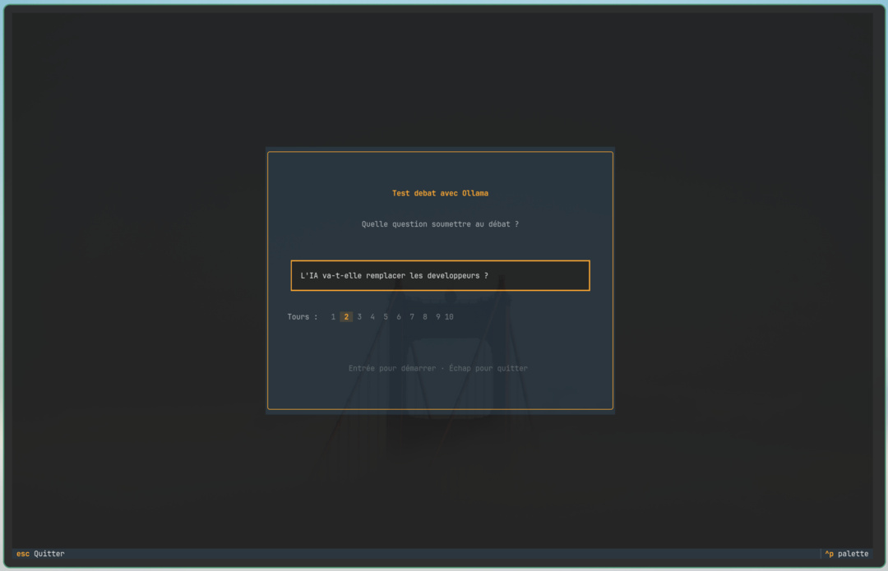
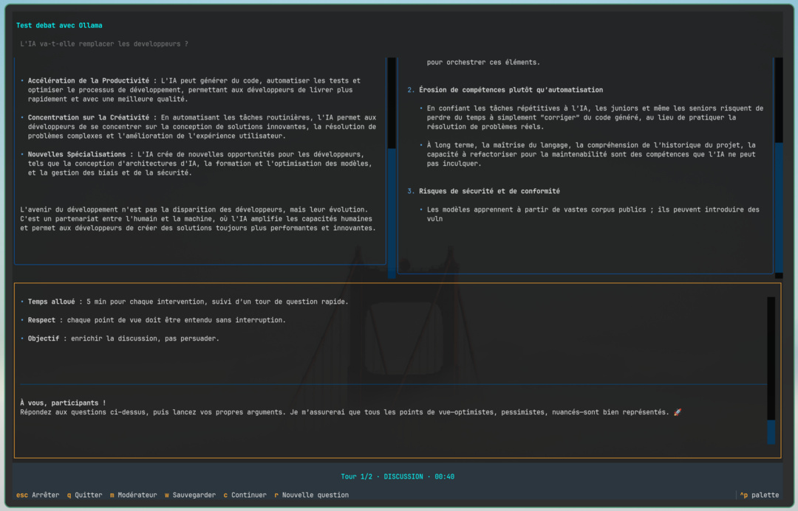

# Agents Meeting (Débat multi-agents avec IA)

[Go to the english version](#agents-meeting-multi-agent-ai-debate)

Système de débat multi-agents avec IA - Interface TUI.

## Demo




Vidéo de démonstration : <https://www.youtube.com/watch?v=A9FqB06vN3s>

## Description

Agents Meeting permet de lancer des débats entre plusieurs agents IA sur un sujet donné. Un agent "leader" modère le débat en :

- Présentant le sujet initial
- Faisant des interventions de synthèse entre les tours
- Posant des questions affinées pour approfondir le débat
- Produisant une synthèse finale

Les agents participants répondent en parallèle à chaque tour.

## Installation

```bash
# Créer l'environnement virtuel
./install.sh

# Activer l'environnement
source venv/bin/activate
```

## Utilisation

### Mode TUI (interface graphique terminal)

```bash
python -m src.main agents-meeting.yaml
```

### Mode CLI (ligne de commande)

```bash
python -m src.main agents-meeting.yaml --cli
```

### Créer un fichier de config

Un fichier YAML d'exemple est fourni. Il suffit de le copier et de le modifier pour créer votre propre configuration.

### Modifier le prompt

```bash
python -m src.main agents-meeting.yaml --prompt "Votre question ici"
```

## Raccourcis clavier (mode TUI)

| Touche   | Action                                  | Disponibilité            |
| -------- | --------------------------------------- | ------------------------ |
| `Entrée` | Démarrer le débat                       | Écran d'accueil          |
| `Échap`  | Arrêter le débat en cours               | Pendant le débat         |
| `m`      | Afficher / masquer la zone modérateur   | Pendant / après le débat |
| `w`      | Sauvegarder la conversation en Markdown | Pendant / après le débat |
| `c`      | Continuer avec une nouvelle question    | Après la fin du débat    |
| `r`      | Nouvelle question (retour à l'accueil)  | Pendant / après le débat |
| `q`      | Quitter                                 | Partout                  |

## Sauvegarde de la conversation

Appuyer sur `w` pendant ou après le débat génère un fichier Markdown contenant :

- Les interventions du modérateur (ouverture, synthèses par tour, conclusion)
- Les réponses de chaque agent par tour

**Nom du fichier :**
Une boîte de dialogue demande le nom du fichier, avec une proposition par défaut `debate_YYYY-MM-DD_HH-MM.md`. Il suffit d'appuyer sur Entrée pour l'accepter.

## Continuation du débat

À la fin d'un débat, appuyer sur `c` permet de lancer une nouvelle session sur une question complémentaire :

- Le modérateur analyse sa synthèse finale et **propose automatiquement une question de suivi**, pré-remplie dans un champ éditable
- La question peut être modifiée librement avant confirmation
- Le **modérateur conserve son historique** et dispose du contexte du débat précédent
- Les **agents participants repartent à zéro**, mais reçoivent la synthèse du modérateur comme point de départ
- Le même nombre de tours que le débat initial est utilisé

## Configuration YAML

### Structure complète

```yaml
title: "Titre de la réunion"

api_keys:
  openai: "env:OPENAI_API_KEY"
  anthropic: "env:ANTHROPIC_API_KEY"
  gemini: "env:GEMINI_API_KEY"
  ollama: "http://localhost:11434"
  custom: "env:CUSTOM_API_KEY"

agents:
  - name: "Nom de l'agent"
    role: "Rôle/description de l'agent"
    provider: "openai | anthropic | gemini | ollama | custom"
    model: "gpt-4o"
    temperature: 0.7
    max_tokens: 2000
    api_key: "env:MON_API_KEY" # Optionnel, prioritaire sur api_keys global
    base_url: "https://api.example.com" # Optionnel
    is_leader: true

debate:
  rounds: 2
  initial_prompt: "Question/prompt initial"
  system_prompt: "System prompt optionnel pour tous les agents"
  leader_prompt: "Instructions additionnelles pour le leader"

  # Templates de prompts (optionnels, valeurs par défaut en anglais)
  intro_prompt: "Tu es le modérateur d'un débat. [...] SUJET : {initial_prompt}"
  moderator_context_prefix: "Le modérateur a dit :\n{content}"
  round_header_template: "Tour {round_num} — Réponses des participants :"
  intervention_prompt: "En tant que modérateur, fais la synthèse..."
  intervention_last_prompt: "En tant que modérateur, fais une synthèse complète..."
  conclusion_prompt: "Question initiale : {initial_prompt}\n\n{turns}\n\n..."
  continuation_prompt: "Tu viens de modérer un débat sur : \"{initial_prompt}\"...\n{conclusion_text}"
  previous_debate_label: '[Synthèse du débat précédent sur "{initial_prompt}"]'
  previous_context_label: '[Contexte — débat précédent sur "{initial_prompt}"]'
  agent_identity_template: "Tu es {name}. {role}"
  agent_context_template: "Contexte des autres agents :\n{context}\n\nQuestion : {prompt}"
```

### Détails des paramètres

#### Top-level

| Paramètre | Type   | Description         |
| --------- | ------ | ------------------- |
| `title`   | string | Titre de la réunion |

#### api_keys

| Paramètre   | Type   | Description                           |
| ----------- | ------ | ------------------------------------- |
| `openai`    | string | Clé API OpenAI (ou `env:VARIABLE`)    |
| `anthropic` | string | Clé API Anthropic (ou `env:VARIABLE`) |
| `gemini`    | string | Clé API Google Gemini (ou `env:VARIABLE`) |
| `ollama`    | string | URL du serveur Ollama                 |
| `custom`    | string | Clé API custom (ou `env:VARIABLE`)    |

#### agents[]

| Paramètre     | Type    | Description                                  | Défaut   |
| ------------- | ------- | -------------------------------------------- | -------- |
| `name`        | string  | Nom de l'agent                               | -        |
| `role`        | string  | Rôle/description de l'agent                  | -        |
| `provider`    | string  | `openai`, `anthropic`, `gemini`, `ollama`, `custom` | -        |
| `model`       | string  | Modèle à utiliser                            | `gpt-4o` |
| `temperature` | float   | Température (0.0-2.0)                        | 0.7      |
| `max_tokens`  | int     | Limite de tokens                             | -        |
| `api_key`     | string  | Clé API locale (ou `env:VARIABLE`)           | -        |
| `base_url`    | string  | URL de l'API (remplace la valeur par défaut) | -        |
| `is_leader`   | boolean | Agent leader/modérateur                      | `false`  |

#### debate

| Paramètre                  | Type   | Description                                                                                  | Défaut |
| -------------------------- | ------ | -------------------------------------------------------------------------------------------- | ------ |
| `rounds`                   | int    | Nombre de tours (1-10)                                                                       | 2      |
| `initial_prompt`           | string | Question/prompt initial                                                                      | -      |
| `system_prompt`            | string | System prompt global (injecté dans tous les agents)                                          | -      |
| `leader_prompt`            | string | Instructions supplémentaires pour le leader uniquement                                       | -      |
| `intro_prompt`             | string | Prompt d'ouverture du débat. Variable : `{initial_prompt}`                                   | (EN)   |
| `moderator_context_prefix` | string | Préfixe du contexte modérateur injecté dans les agents. Variable : `{content}`               | (EN)   |
| `round_header_template`    | string | En-tête de chaque tour dans le prompt du leader. Variable : `{round_num}`                    | (EN)   |
| `intervention_prompt`      | string | Instruction de synthèse pour les tours intermédiaires                                        | (EN)   |
| `intervention_last_prompt` | string | Instruction de synthèse pour le dernier tour                                                 | (EN)   |
| `conclusion_prompt`        | string | Prompt de synthèse finale. Variables : `{initial_prompt}`, `{turns}`                         | (EN)   |
| `continuation_prompt`      | string | Prompt de question de suivi. Variables : `{initial_prompt}`, `{conclusion_text}`             | (EN)   |
| `previous_debate_label`    | string | Étiquette injectée dans l'historique du leader (continuation). Variable : `{initial_prompt}` | (EN)   |
| `previous_context_label`   | string | Étiquette de contexte pour les agents (continuation). Variable : `{initial_prompt}`          | (EN)   |
| `agent_identity_template`  | string | Template d'identité de l'agent dans le system prompt. Variables : `{name}`, `{role}`         | (EN)   |
| `agent_context_template`   | string | Template du message utilisateur avec contexte. Variables : `{context}`, `{prompt}`           | (EN)   |

> **(EN)** = valeur par défaut en anglais définie dans le code. Surcharger dans le YAML pour utiliser une autre langue (voir `agents-meeting.example.yaml`).

## Providers

| Provider  | Modèles disponibles                                |
| --------- | -------------------------------------------------- |
| OpenAI    | `gpt-4o`, `gpt-4`, `gpt-3.5-turbo`, etc.           |
| Anthropic | `claude-3-5-sonnet-*`, `claude-3-opus-*`, etc.     |
| Gemini    | `gemini-2.0-flash`, `gemini-1.5-pro`, etc.        |
| Ollama    | Modèles locaux (`llama3`, `mistral`, `phi3`, etc.) |
| Custom    | API compatible OpenAI                              |

### Ollama (local)

Pour utiliser Ollama en local :

1. Installer Ollama : https://ollama.ai
2. Lancer le serveur : `ollama serve`
3. Télécharger un modèle : `ollama pull llama3`

Exemple de configuration :

```yaml
agents:
  - name: "Agent1"
    provider: "ollama"
    model: "llama3"
    base_url: "http://localhost:11434"
```

## Exemple complet

```yaml
title: "Débat: L'IA et l'emploi"

api_keys:
  openai: "env:OPENAI_API_KEY"
  anthropic: "env:ANTHROPIC_API_KEY"

agents:
  - name: "Modérateur"
    role: "Anime le débat, synthétise les positions"
    provider: "openai"
    model: "gpt-4o"
    temperature: 0.5
    is_leader: true

  - name: "Optimiste"
    role: "Voit les opportunités et le potentiel de l'IA"
    provider: "anthropic"
    model: "claude-3-5-sonnet-20241022"
    temperature: 0.8

  - name: "Sceptique"
    role: "Remet en question les bénéfices et souligne les risques"
    provider: "ollama"
    model: "llama3"
    base_url: "http://localhost:11434"
    temperature: 0.7

debate:
  rounds: 2
  initial_prompt: "L'IA va-t-elle remplacer les développeurs ?"
  system_prompt: "Tu participes à un débat structuré. Sois concis et argumenté."
  leader_prompt: "En tant que modérateur, assure-toi que tous les points de vue sont exprimés."
```

## Variables d'environnement

Les clés API peuvent être passées via des variables d'environnement :

```bash
export OPENAI_API_KEY="sk-..."
export ANTHROPIC_API_KEY="sk-ant-..."
export GEMINI_API_KEY="AIza..."

python -m src.main agents-meeting.yaml
```

Ou directement dans le fichier YAML avec le préfixe `env:` :

```yaml
api_keys:
  openai: "env:OPENAI_API_KEY"
  gemini: "env:GEMINI_API_KEY"
```

# English Version

# Agents Meeting (Multi-Agent AI Debate)

Multi-agent AI debate system - TUI interface.

## Demo


Demo video: <https://www.youtube.com/watch?v=A9FqB06vN3s>

## Description

Agents Meeting enables launching debates between multiple AI agents on a given topic. A "leader" agent moderates the debate by:

- Presenting the initial topic
- Providing synthesis interventions between rounds
- Asking refined questions to deepen the debate
- Producing a final summary

Participant agents respond in parallel each round.

## Installation

```bash
# Create virtual environment
./install.sh

# Activate environment
source venv/bin/activate
```

## Usage

### TUI mode (terminal graphical interface)

```bash
python -m src.main agents-meeting.yaml
```

### CLI mode (command line)

```bash
python -m src.main agents-meeting.yaml --cli
```

### Create a config file

Look at the example YAML file and create your own.

### Modify the prompt

```bash
python -m src.main agents-meeting.yaml --prompt "Your question here"
```

## Keyboard shortcuts (TUI mode)

| Key     | Action                           | Availability        |
| ------- | -------------------------------- | ------------------- |
| `Enter` | Start the debate                 | Welcome screen      |
| `Esc`   | Stop the current debate          | During debate       |
| `m`     | Show/hide moderator zone         | During/after debate |
| `w`     | Save conversation to Markdown    | During/after debate |
| `c`     | Continue with a new question     | After debate ends   |
| `r`     | New question (return to welcome) | During/after debate |
| `q`     | Quit                             | Everywhere          |

## Conversation save

Pressing `w` during or after the debate generates a Markdown file containing:

- Moderator interventions (opening, round summaries, conclusion)
- Each agent's responses by round

**File name:**
A dialog asks for the file name, with a default proposal `debate_YYYY-MM-DD_HH-MM.md`. Just press Enter to accept.

## Debate continuation

At the end of a debate, pressing `c` launches a new session on a complementary question:

- The moderator analyzes their final summary and **automatically proposes a follow-up question**, pre-filled in an editable field
- The question can be freely modified before confirmation
- **The moderator retains their history** and has context from the previous debate
- **Participant agents start fresh**, but receive the moderator's summary as a starting point
- The same number of rounds as the initial debate is used

## YAML configuration

### Complete structure

```yaml
title: "Meeting title"

api_keys:
  openai: "env:OPENAI_API_KEY"
  anthropic: "env:ANTHROPIC_API_KEY"
  gemini: "env:GEMINI_API_KEY"
  ollama: "http://localhost:11434"
  custom: "env:CUSTOM_API_KEY"

agents:
  - name: "Agent name"
    role: "Role/description of the agent"
    provider: "openai | anthropic | gemini | ollama | custom"
    model: "gpt-4o"
    temperature: 0.7
    max_tokens: 2000
    api_key: "env:MY_API_KEY" # Optional, takes precedence over global api_keys
    base_url: "https://api.example.com" # Optional
    is_leader: true

debate:
  rounds: 2
  initial_prompt: "Initial question/prompt"
  system_prompt: "Optional system prompt for all agents"
  leader_prompt: "Additional instructions for the leader"

  # Prompt templates (optional, English defaults built-in)
  intro_prompt: "You are the moderator of a debate. [...] TOPIC: {initial_prompt}"
  moderator_context_prefix: "The moderator said:\n{content}"
  round_header_template: "Round {round_num} — Participant responses:"
  intervention_prompt: "As moderator, synthesize the positions..."
  intervention_last_prompt: "As moderator, provide a complete synthesis..."
  conclusion_prompt: "Original question: {initial_prompt}\n\n{turns}\n\n..."
  continuation_prompt: "You just moderated a debate on: \"{initial_prompt}\"...\n{conclusion_text}"
  previous_debate_label: '[Synthesis of previous debate on "{initial_prompt}"]'
  previous_context_label: '[Context — previous debate on "{initial_prompt}"]'
  agent_identity_template: "You are {name}. {role}"
  agent_context_template: "Other agents' context:\n{context}\n\nQuestion: {prompt}"
```

### Parameter details

#### Top-level

| Parameter | Type   | Description   |
| --------- | ------ | ------------- |
| `title`   | string | Meeting title |

#### api_keys

| Parameter   | Type   | Description                             |
| ----------- | ------ | --------------------------------------- |
| `openai`    | string | OpenAI API key (or `env:VARIABLE`)      |
| `anthropic` | string | Anthropic API key (or `env:VARIABLE`)  |
| `gemini`    | string | Google Gemini API key (or `env:VARIABLE`) |
| `ollama`    | string | Ollama server URL                       |
| `custom`    | string | Custom API key (or `env:VARIABLE`)      |

#### agents[]

| Parameter     | Type    | Description                               | Default  |
| ------------- | ------- | ----------------------------------------- | -------- |
| `name`        | string  | Agent name                                | -        |
| `role`        | string  | Role/description of the agent             | -        |
| `provider`    | string  | `openai`, `anthropic`, `gemini`, `ollama`, `custom` | -        |
| `model`       | string  | Model to use                              | `gpt-4o` |
| `temperature` | float   | Temperature (0.0-2.0)                     | 0.7      |
| `max_tokens`  | int     | Token limit                               | -        |
| `api_key`     | string  | Local API key (or `env:VARIABLE`)         | -        |
| `base_url`    | string  | API URL (replaces default value)          | -        |
| `is_leader`   | boolean | Leader/moderator agent                    | `false`  |

#### debate

| Parameter                  | Type   | Description                                                                        | Default |
| -------------------------- | ------ | ---------------------------------------------------------------------------------- | ------- |
| `rounds`                   | int    | Number of rounds (1-10)                                                            | 2       |
| `initial_prompt`           | string | Initial question/prompt                                                            | -       |
| `system_prompt`            | string | Global system prompt (injected into all agents)                                    | -       |
| `leader_prompt`            | string | Additional instructions for the leader only                                        | -       |
| `intro_prompt`             | string | Debate opening prompt. Variable: `{initial_prompt}`                                | (EN)    |
| `moderator_context_prefix` | string | Moderator context prefix injected into agents. Variable: `{content}`               | (EN)    |
| `round_header_template`    | string | Header line in the leader's intervention prompt. Variable: `{round_num}`           | (EN)    |
| `intervention_prompt`      | string | Synthesis instruction for mid-debate rounds                                        | (EN)    |
| `intervention_last_prompt` | string | Synthesis instruction for the final round                                          | (EN)    |
| `conclusion_prompt`        | string | Final synthesis prompt. Variables: `{initial_prompt}`, `{turns}`                   | (EN)    |
| `continuation_prompt`      | string | Follow-up question prompt. Variables: `{initial_prompt}`, `{conclusion_text}`      | (EN)    |
| `previous_debate_label`    | string | Label injected into leader's history (continuation). Variable: `{initial_prompt}`  | (EN)    |
| `previous_context_label`   | string | Context label for agents (continuation). Variable: `{initial_prompt}`              | (EN)    |
| `agent_identity_template`  | string | Agent identity line in system prompt. Variables: `{name}`, `{role}`                | (EN)    |
| `agent_context_template`   | string | User message template when context is provided. Variables: `{context}`, `{prompt}` | (EN)    |

> **(EN)** = English default defined in code. Override in YAML to use a different language (see `agents-meeting.example.yaml`).

## Providers

| Provider  | Available models                                 |
| --------- | ------------------------------------------------ |
| OpenAI    | `gpt-4o`, `gpt-4`, `gpt-3.5-turbo`, etc.         |
| Anthropic | `claude-3-5-sonnet-*`, `claude-3-opus-*`, etc.   |
| Gemini    | `gemini-2.0-flash`, `gemini-1.5-pro`, etc.        |
| Ollama    | Local models (`llama3`, `mistral`, `phi3`, etc.) |
| Custom    | OpenAI-compatible API                            |

### Ollama (local)

To use Ollama locally:

1. Install Ollama: https://ollama.ai
2. Start the server: `ollama serve`
3. Download a model: `ollama pull llama3`

Configuration example:

```yaml
agents:
  - name: "Agent1"
    provider: "ollama"
    model: "llama3"
    base_url: "http://localhost:11434"
```

## Complete example

```yaml
title: "Debate: AI and employment"

api_keys:
  openai: "env:OPENAI_API_KEY"
  anthropic: "env:ANTHROPIC_API_KEY"

agents:
  - name: "Moderator"
    role: "Leads the debate, synthesizes positions"
    provider: "openai"
    model: "gpt-4o"
    temperature: 0.5
    is_leader: true

  - name: "Optimist"
    role: "Sees opportunities and AI potential"
    provider: "anthropic"
    model: "claude-3-5-sonnet-20241022"
    temperature: 0.8

  - name: "Skeptic"
    role: "Questions benefits and highlights risks"
    provider: "ollama"
    model: "llama3"
    base_url: "http://localhost:11434"
    temperature: 0.7

debate:
  rounds: 2
  initial_prompt: "Will AI replace developers?"
  system_prompt: "You are participating in a structured debate. Be concise and argumentative."
  leader_prompt: "As moderator, ensure all viewpoints are expressed."
```

## Environment variables

API keys can be passed via environment variables:

```bash
export OPENAI_API_KEY="sk-..."
export ANTHROPIC_API_KEY="sk-ant-..."
export GEMINI_API_KEY="AIza..."

python -m src.main agents-meeting.yaml
```

Or directly in the YAML file with the `env:` prefix:

```yaml
api_keys:
  openai: "env:OPENAI_API_KEY"
  gemini: "env:GEMINI_API_KEY"
```
